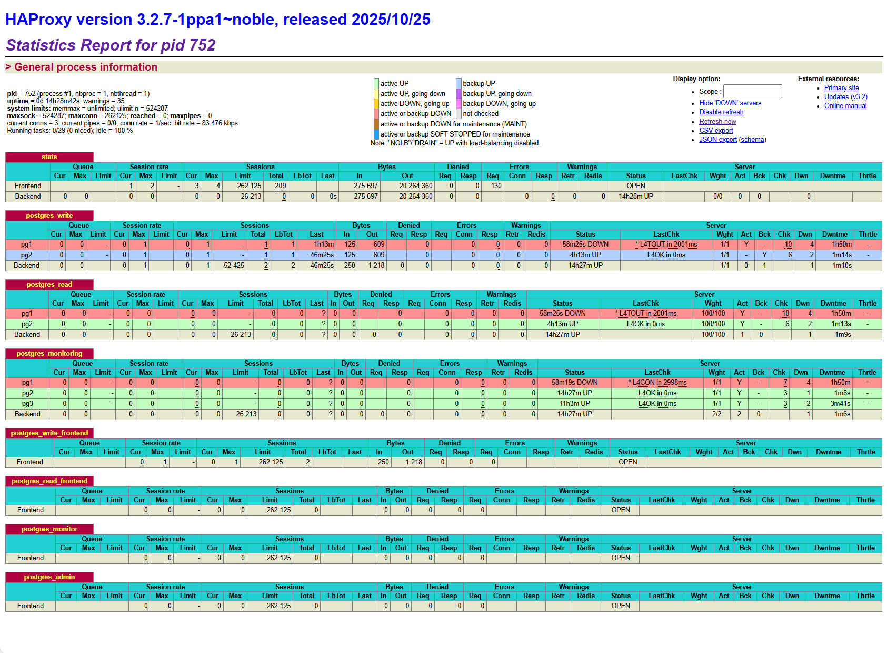

```
 Host  |       IP         |     VIP		 |        Role
 ------|------------------|-------------------------------------------
 HA1   |	192.168.1.71  |	192.168.1.70 |  HAproxy+keepalived
 HA2   |	192.168.1.72  |	192.168.1.70 |  HAproxy+keepalived
 PG1   |	192.168.1.81  |	    		 |  leader/synchronius replica
 PG2   |	192.168.1.82  |	    		 |  leader/synchronius replica
 PG3   |	192.168.1.83  |	    		 |	asynchronius replica
 ETCD1 |	192.168.1.91  |				 |
 ETCD2 |	192.168.1.92  |				 |
 ETCD3 |	192.168.1.93  |				 |
```

### Установка и настройка HAproxy

#### Беру версию 3.2 из репозитория разработчика HAProxy:
`sudo add-apt-repository ppa:vbernat/haproxy-3.2
sudo apt update
sudo apt install haproxy
haproxy -v`
Version: 3.2.7-1ppa1~noble

`systemctl stop haproxy`

#### Конфиг HAProxy

```
cat > /etc/haproxy/haproxy.cfg <<EOF
global
    log /dev/log local0
    log /dev/log local1 notice
    chroot /var/lib/haproxy
    stats socket /run/haproxy/admin.sock mode 660 level admin expose-fd listeners
    stats timeout 30s
    user haproxy
    group haproxy
    daemon

defaults
    log global
    mode tcp
    option tcplog
    option dontlognull
    timeout connect 5000ms
    timeout client 50000ms
    timeout server 50000ms
    retries 3
    option redispatch
    timeout check 5000ms

# web-морда статистики HAProxy; оказалась приятным бонусом
listen stats
    bind *:8404
    mode http
    stats enable
    stats uri /monitor
    stats refresh 5s
    stats auth admin:password

# бэкенд для записи - только лидер
backend postgres_write
    mode tcp
    balance first
    option tcp-check
    tcp-check connect port 5432
    server pg1 192.168.1.81:5432 check inter 2s fall 3 rise 2
    server pg2 192.168.1.82:5432 check inter 2s fall 3 rise 2 backup

# бэкенд для чтения - лидер и синхронная реплика
backend postgres_read
    mode tcp
    balance leastconn
    option tcp-check
    tcp-check connect port 5432
    server pg1 192.168.1.81:5432 check inter 2s fall 3 rise 2 weight 100
    server pg2 192.168.1.82:5432 check inter 2s fall 3 rise 2 weight 100

# бэкенд для мониторинга состояния всех нод
backend postgres_monitoring
    mode tcp
    balance roundrobin
    option tcp-check
    tcp-check connect port 5432
    server pg1 192.168.1.81:5432 check inter 5s fall 2 rise 1
    server pg2 192.168.1.82:5432 check inter 5s fall 2 rise 1
    server pg3 192.168.1.83:5432 check inter 5s fall 2 rise 1

# фронтенд для операций записи
frontend postgres_write_frontend
    bind *:5432
    mode tcp
    option tcplog
    default_backend postgres_write

# фронтенд для операций чтения
frontend postgres_read_frontend
    bind *:5433
    mode tcp
    option tcplog
    default_backend postgres_read

# фронтенд для мониторинга
frontend postgres_monitor
    bind *:5434
    mode tcp
    option tcplog
    default_backend postgres_monitoring

# фронтенд для администрирования
frontend postgres_admin
    bind *:5435
    mode tcp
    option tcplog
    default_backend postgres_write
EOF
```

### Установка keepalived

#### Подготовка

`sudo apt update
sudo apt install build-essential
sudo apt install libssl-dev libnl-3-dev libnl-genl-3-dev pkg-config
wget https://www.keepalived.org/software/keepalived-2.3.4.tar.gz
tar xzf keepalived-2.3.4.tar.gz`

#### Установка

`cd keepalived-2.3.4
./configure --prefix=/usr --sysconfdir=/etc
make
sudo make install
keepalived --version`
Keepalived v2.3.4 (06/10,2025)

#### Конфиг keepalived на мастер-ноде HA1 (192.168.1.71)

/etc/keepalived/keepalived.conf:

```
cat > /etc/keepalived/keepalived.conf <<EOF
vrrp_script chk_haproxy {
    script "/usr/bin/killall -0 haproxy"
    interval 2
    weight 2
    fall 2
    rise 2
}
vrrp_instance VI_1 {
    state MASTER
    interface enp0s3 
    virtual_router_id 51
    priority 101 
    advert_int 1
    authentication {
        auth_type PASS
        auth_pass 1111
    }
    virtual_ipaddress {
        192.168.1.70/24 dev enp0s3  # ЗАМЕНИТЕ на ваш интерфейс!
    }
    track_script {
        chk_haproxy
    }
    # Уведомления для логирования
    notify "/etc/keepalived/notify.sh"
}
EOF
```

#### Конфиг keepalived на бэкап-ноде HA2 (192.168.1.71)
/etc/keepalived/keepalived.conf:

```
cat > /etc/keepalived/keepalived.conf <<EOF
vrrp_script chk_haproxy {
    script "/usr/bin/killall -0 haproxy"
    interval 2
    weight 2
    fall 2
    rise 2
}
vrrp_instance VI_1 {
    state BACKUP
    interface enp0s3
    virtual_router_id 51
    priority 100
    advert_int 1
    authentication {
        auth_type PASS
        auth_pass 1111
    }
    virtual_ipaddress {
        192.168.1.70/24 dev enp0s3
    }
    track_script {
        chk_haproxy
    }
}
EOF
```

### Открыл порты на HA1, HA2:

`sudo ufw allow 5432,5433,5434,5435,8404,8405/tcp`

### Разрешил протокол VRRP только между HA нодами
`sudo ufw allow from 192.168.1.71 to 192.168.1.72 proto vrrp
sudo ufw allow from 192.168.1.72 to 192.168.1.71 proto vrrp`

### Включение автозапуска
`sudo systemctl enable keepalived
sudo systemctl enable haproxy`

### Запуск на обеих нодах
`sudo systemctl start haproxy
sudo systemctl start keepalived`

### Проверка статуса
`sudo systemctl status keepalived
sudo systemctl status haproxy`

#### Проверка статуса сервисов 
`sudo systemctl status haproxy --no-pager | grep "Active:"
sudo systemctl status keepalived --no-pager | grep "Active:"`
Active: active (running) since Wed 2025-11-05 15:40:29 +05; 3h 28min ago
Active: active (running) since Wed 2025-11-05 15:15:53 +05; 3h 53min ago

#### Проверка VIP
#### На HA1:
`echo "HA1: $(ip addr show | grep -q 192.168.1.70 && echo 'MASTER' || echo 'BACKUP')"`
HA1: MASTER

#### На HA2:  
`echo "HA2: $(ip addr show | grep -q 192.168.1.70 && echo 'MASTER' || echo 'BACKUP')"`
HA2: BACKUP

#### Контроль логов на обеих нодах
	cat /var/log/haproxy.log

#### Проверка работоспособности режима balance leastconn
```
otus@pg3:~$ results=""
for i in {1..15}; do
    server=$(psql -h 192.168.1.70 -p 5433 -U postgres -t -c "SELECT inet_server_addr();" 2>/dev/null | tr -d ' ')
    results="${results}${server}\n"
    echo -n "."
    sleep 0.2
done

echo -e "\n\n=== Результаты распределения ==="
echo -e "$results" | sort | uniq -c | while read count server; do
    echo "Сервер $server: $count подключений"
done
...............

=== Результаты распределения ===
Сервер : 1 подключений
Сервер 192.168.1.81: 7 подключений
Сервер 192.168.1.82: 8 подключений
```

#### Мониторинг HAProxy
http://192.168.1.70:8404/monitor



#### Здесь можно видеть статусы нод кластера Patroni: 

#### PG1 - выключен, PG2, PG3 - доступны.
